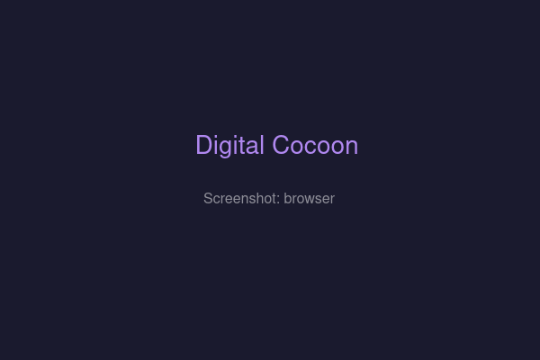
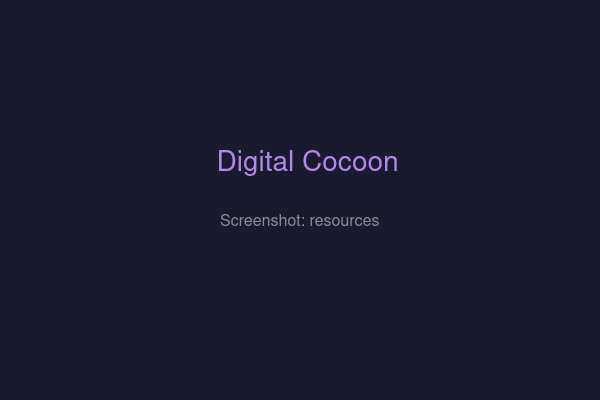
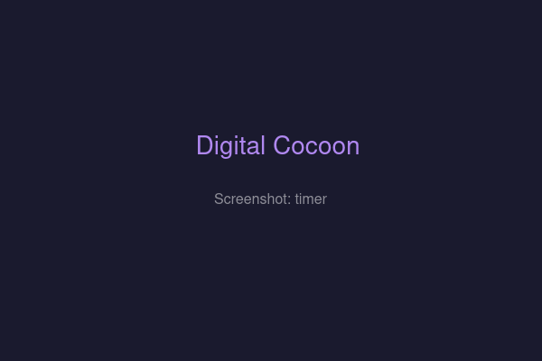

<div align="center">
  <h1>🦋 Digital Cocoon</h1>
  <p><strong>A layered audio/video ambient mixer — YouTube, music, and ambient sound layers in a glassmorphic cocoon.</strong></p>

  <p>
    
    
    
    
    
    
  </p>

  <p>
    <a href="#features">Features</a> •
    <a href="#screenshots">Screenshots</a> •
    <a href="#quick-start">Quick Start</a> •
    <a href="#desktop-apps">Desktop Apps</a> •
    <a href="#tech-stack">Tech Stack</a>
  </p>
</div>

---

## ✨ Features

<table>
<tr>
<td width="50%">

### 🎬 Visual Layer
YouTube video via IFrame Player API with independent volume. Switch to **Vinyl Mode** for a spinning record animation.

</td>
<td width="50%">

### 🎵 Dynamic Sound Channels
Add unlimited audio layers — rain, train, lofi, coffee shop, anything. Each channel has independent volume, play/pause with smooth fade transitions, and seek controls.

</td>
</tr>
<tr>
<td>

### 🔍 YouTube Browser
Search YouTube from inside the app via yt-dlp. Browse built-in sounds organized by categories (Nature, City, Music, Ambient, White Noise).

</td>
<td>

### 💾 Scenes (Presets)
Save and load named mixes. Each scene stores your visual source + all audio channels with their volumes. Cycle through scenes with keyboard shortcuts.

</td>
</tr>
<tr>
<td>

### 🎚️ Mixer Panel
Full channel strip view with per-channel faders, mute/solo, master volume, and all-play/pause. Sorted with active channels first.

</td>
<td>

### ⏰ Sleep Timer
Built-in sleep timer: 15 / 30 / 60 / 120 minutes. Fades all audio to silence when time runs out.

</td>
</tr>
<tr>
<td>

### ⌨️ Keyboard Shortcuts
- **Space** — Toggle all play/pause
- **1–9** — Toggle individual channels
- **Ctrl+↑/↓** — Master volume up/down
- **←/→** (zen mode) — Previous/next scene

</td>
<td>

### 🎨 8 Themes + Custom BGs
Light, Warm, Dark, Black, Claude, Claw, Opencode, Coffee — plus two exclusive themes (Calm Pastel, Uniorec Deep Purple). Custom backgrounds: solid color, image URL, or animated gradients.

</td>
</tr>
</table>

---

## 📸 Screenshots

> *Screenshots coming soon. Build & run locally to see the full UI.*

| Player Card | Sound Browser | Mixer Panel |
|---|---|---|
|  |  |  |

| Scenes | Resources | Sleep Timer |
|---|---|---|
|  |  |  |

---

## 🚀 Quick Start

```sh
# Clone & install
git clone https://github.com/Artur-Nayman/cocoon-app.git
cd cocoon-app
npm install

# Frontend only (YouTube video + direct MP3s work)
npm run dev

# Full stack with YouTube audio extraction
cd server && npm install && cd ..
npm start    # runs server + frontend via concurrently
```

Open **http://localhost:5173** (or the port Vite shows).

> **Backend is optional.** The app works without it — direct audio URLs and YouTube video still play. A banner appears when yt-dlp is unavailable.

---

## 🖥️ Desktop Apps

### Linux & Windows (Electron)

```sh
# Development mode (requires Vite dev server)
npm run electron:dev

# Build standalone packages
npm run electron:build:linux   # produces .AppImage + .deb in release/
npm run electron:build:win     # produces .exe installer in release/
```

### One-command install (Linux)

```sh
./scripts/install.sh
```

This rebuilds the AppImage with latest code, installs it to `~/.local/bin/`, adds a desktop entry for your launcher, and installs the app icon.

### KDE Plasma 6 Widget

The `plasmoid/` directory contains a Plasma 6 widget that embeds the app via WebEngineView.

```sh
cd plasmoid
make install
```

Add **Digital Cocoon** to your panel/desktop. Requires `qtwebengine` and `kpackagetool6`.

---

## 🔧 Backend (YouTube Audio Extraction)

The Express server uses **yt-dlp** to extract playable audio URLs from YouTube links.

| Endpoint | Method | Description |
|---|---|---|
| `/api/audio/extract` | GET | `?url=` — returns `{ success, audioUrl }` |
| `/api/youtube/search` | GET | `?q=` — returns `{ success, results[] }` |

```sh
cd server
npm install
npm start    # runs on port 3001
```

Requires **yt-dlp** on your system PATH. Format fallback strategies handle live streams, DASH, HLS, and direct audio.

---

## 📁 Project Structure

```
├── electron/
│   ├── main.cjs              # Electron main process (frameless, transparent)
│   ├── preload.cjs            # Context bridge API
│   └── server.cjs             # Embedded Express server for desktop builds
├── src/
│   ├── components/            # React components
│   │   ├── App.jsx            # Root — all state lives here
│   │   ├── ChannelCard.jsx    # Compact pill card with SVG volume ring
│   │   ├── ChannelGrid.jsx    # Wrapping flex grid of pills
│   │   ├── SoundBrowser.jsx   # YouTube search + built-in sound library
│   │   ├── MixerPanel.jsx     # Full channel strip mixer
│   │   ├── SleepTimer.jsx     # 15/30/60/120 min timer
│   │   ├── VisualLayer.jsx    # YouTube IFrame player or vinyl
│   │   ├── SceneManager.jsx   # Scene CRUD
│   │   ├── ResourcesPanel.jsx # Resource library
│   │   ├── TabPanel.jsx       # Sidebar tabs
│   │   └── ThemeSwitcher.jsx  # 8 themes + custom backgrounds
│   ├── hooks/                 # Custom React hooks
│   │   ├── useAudioLayer.js   # Audio element + HLS + fade + seek
│   │   ├── useYouTube.js      # YouTube IFrame Player API
│   │   ├── useSceneManager.js # Scene CRUD (localStorage)
│   │   ├── useSleepTimer.js   # Timer countdown
│   │   └── useKeyboardShortcuts.js
│   ├── styles/                # CSS Modules + global theme variables
│   ├── utils/                 # AudioContext singleton, YouTube ID parser
│   └── constants/defaults.js  # Default scenes + resources + channel colors
├── server/
│   ├── index.js               # Express entry point
│   ├── routes/youtube.js      # YouTube search endpoint
│   └── services/
│       ├── ytdlp.js           # Audio extraction strategies
│       └── youtubeSearch.js   # yt-dlp search wrapper
└── scripts/
    └── install.sh             # One-command rebuild + install
```

---

## 🧱 Tech Stack

| Layer | Technology |
|---|---|
| **Frontend** | React 19, Vite 8, CSS Modules |
| **Audio** | Web Audio API, hls.js (lazy-loaded) |
| **YouTube** | IFrame Player API (video), yt-dlp (audio extraction) |
| **Desktop** | Electron 37 + electron-builder |
| **Widget** | Qt6 QML / Kirigami / Plasma 6 |
| **Backend** | Express 4, yt-dlp |
| **Design** | Glassmorphism (`backdrop-filter`), CSS custom properties |

---

## 🎨 Themes

| Theme | Description |
|---|---|
| `light` / `warm` / `dark` / `black` | Standard light-to-dark |
| `claude` / `claw` / `opencode` / `coffee` | Developer & coffee-inspired |
| `calm` / `uniorec` | Exclusive pastel & deep purple themes |

Custom backgrounds: solid color picker, image URL, or animated (Gradient Drift, Aurora, Floating Particles).

---

## 🤝 Contributing

Open issues and pull requests on [GitHub](https://github.com/Artur-Nayman/cocoon-app). For feature ideas or bugs, start a discussion.

---

<div align="center">
  <sub>Built with ❤️ using React, Electron, and yt-dlp</sub>
  <br>
  <sub>© 2026 — Digital Cocoon</sub>
</div>
